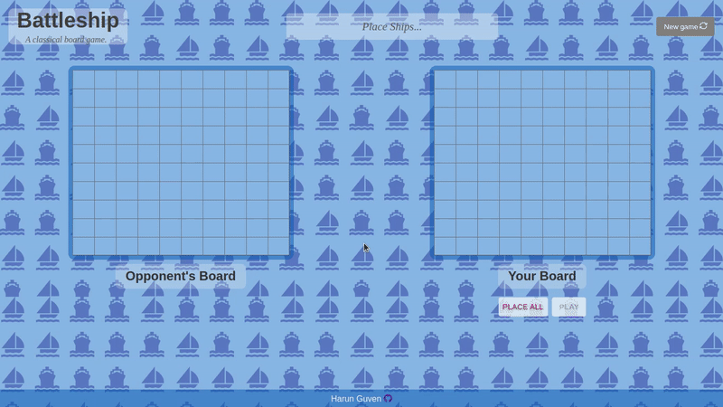

# Battleship
[Live Demo](https://harunfr.github.io/battleship/) :point_left:
<!-- Short description about application.   -->
Classical board game, playable against bot.
<!-- end of short description.  -->



<!-- More detailed description about application.  -->
## Rules of Game
* Player win by attacking and sinking all of the opponent's ship.

* Playing side changes with every attack.
* There should be at least 1 empty block between ships.
---
## UI and Game Logic Decisions.
* Varied blue tones used to give navy theme.

* OOP paradigm used in this application heavily, as a result game logic is more imperative.
* Ships, gameboard, player, game are all objects which created using es6 class syntax. Other option was factory functions.
* To project game to screen, still more declarative code used, namely react-way.
* Game logic is enough separated from UI logic. As a metric for this: game can be run on console easily.
* Have written tests to be sure that game logic runs without bugs and cheap to modify later.
* I didn't want drag & drop feature because I wouldn't want to place all ships by hand, there is
4 boats, 3 cruisers, 2 destroyers and 1 battleship, instead I implemented "randomly place all" button.
* With every valid attack 100(player) + 100(opponent) = 200 rerender occurs. React reconciliation mechanism is still efficient, so I didn't make any optimization about that.
<!-- end of detailed description. -->
----
<!-- Detailed technical description about application.  -->
## Misc. Notes
* With some transparent white background, dark colored page components can be put on top of each other.

* Game tests implemented as if there wil be drag and drop and smartly attacking bot, but cancelled those nice features later.
* Bot blindly attacks player's board.
* This application can be used learn "performantly rendering list in react" topic.

<!-- end of detailed technical description. -->
----

### Clone, Browse, Build, Run.
```markdown
		git clone git@github.com:harunfr/battleship.git && cd battleship/ && code . && npm i && npm start
```
